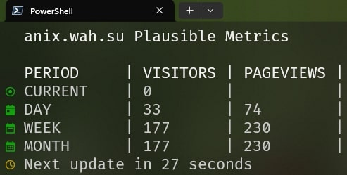

# Plausible Terminal Metrics

Simple python cli script to show metrics for your website on plausible

## Requirements

- Python 3
- Nerd Fonts installed and enabled in the terminal for the icons to word

## Installation

1. clone the repository
2. install requirements
3. copy .env.example to .env and fill it with your values
4. run python TerminalMetrics.py
